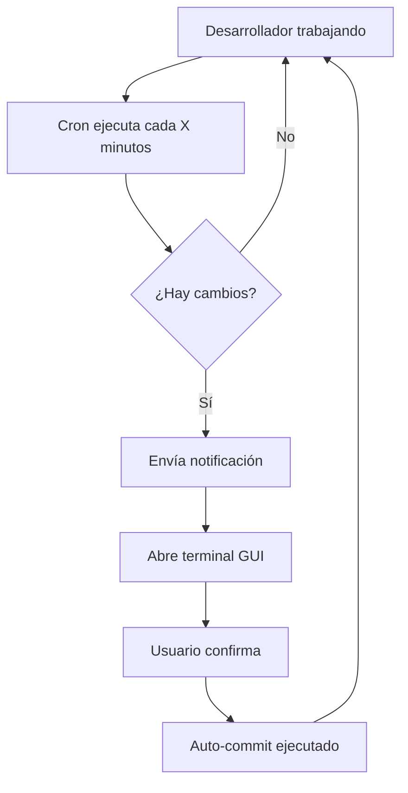

# Sistema de Auto-Commit para Competencias - Resumen de Implementación

## 🎯 Optimizaciones para Competencias

Se ha implementado un sistema completo de auto-commit optimizado específicamente para entornos de competencia de desarrollo de software con las siguientes mejoras:

### ⚡ Intervalos Ultra-Rápidos

**Intervalos disponibles:**

- **1 minuto** - Competencia extrema (hackathons)
- **2 minutos** - Competencia intensa
- **5 minutos** - Desarrollo sprint
- **10 minutos** - Desarrollo activo
- **15 minutos** - Trabajo normal
- **30 minutos** - Trabajo pausado

### 🏆 Perfiles de Competencia

#### 1. Perfil HACKATHON 🏃‍♂️

```bash
./_scripts/competition-setup.sh hackathon
```

- ✅ Commits cada **1 minuto**
- ✅ Hasta **20 archivos** por commit
- ✅ Máxima velocidad
- ✅ Mínima interrupción

#### 2. Perfil SPRINT ⚡

```bash
./_scripts/competition-setup.sh sprint
```

- ✅ Commits cada **5 minutos**
- ✅ Hasta **15 archivos** por commit
- ✅ Balance velocidad/calidad
- ✅ Confirmación rápida

#### 3. Perfil COLABORATIVO 🤝

```bash
./_scripts/competition-setup.sh collaborative
```

- ✅ Commits cada **10 minutos**
- ✅ Hasta **10 archivos** por commit
- ✅ Enfoque en calidad
- ✅ Confirmación completa

### 🛠️ Scripts Especializados

1. **`competition-setup.sh`** - Configuración one-click para competencias
2. **`setup-cron-commit.sh`** - Gestión avanzada de intervalos cron
3. **`cron-auto-commit.sh`** - Ejecución compatible con cron + GUI
4. **`notification-handler.sh`** - Manejo inteligente de notificaciones

### 📊 Características Avanzadas

#### Configuración Dinámica

- Ajuste automático de `max_files_per_commit` según el perfil
- Nuevos tipos de commit: `wip`, `quick`
- Timeout de notificaciones optimizado
- Modo competencia en configuración JSON

#### Interfaz Mejorada

- Emojis y colores para identificación rápida
- Menús contextuales por tipo de competencia
- Recomendaciones automáticas por escenario
- Información clara de configuración activa

#### Integración Cron Robusta

- Manejo de bloqueos (lock files)
- Notificaciones desktop automáticas
- Apertura de terminal GUI cuando es necesario
- Limpieza automática de archivos temporales

### 🚀 Flujo de Trabajo Optimizado



### 📈 Comparación de Intervalos

| Contexto     | Intervalo | Archivos/Commit | Velocidad  | Calidad    |
| ------------ | --------- | --------------- | ---------- | ---------- |
| Hackathon    | 1 min     | 20              | 🚀🚀🚀🚀🚀 | ⭐⭐       |
| Sprint       | 5 min     | 15              | 🚀🚀🚀🚀   | ⭐⭐⭐     |
| Colaborativo | 10 min    | 10              | 🚀🚀🚀     | ⭐⭐⭐⭐⭐ |
| Normal       | 15-30 min | 10              | 🚀🚀       | ⭐⭐⭐⭐⭐ |

### 🎮 Comandos Esenciales para Competencia

```bash
# Configuración rápida para hackathon
./_scripts/competition-setup.sh hackathon

# Ver estado actual del sistema
./_scripts/competition-setup.sh status

# Manejar notificaciones pendientes
./_scripts/notification-handler.sh

# Commit manual inmediato
./_scripts/auto-commit.sh

# Limpiar configuración
./_scripts/competition-setup.sh clean
```

### 💡 Recomendaciones de Uso

#### Para Hackathons (24-48 horas)

- Usar perfil `hackathon` (1-2 min)
- Commits frecuentes con mensajes automáticos
- Focus en velocidad sobre perfección

#### Para Sprints (1-2 semanas)

- Usar perfil `sprint` (5 min)
- Balance entre velocidad y calidad
- Commits descriptivos pero rápidos

#### Para Trabajo Colaborativo

- Usar perfil `collaborative` (10 min)
- Commits bien documentados
- Coordinación con el equipo

### 🔒 Características de Seguridad

- **Lock files** previenen ejecuciones múltiples
- **Confirmación del usuario** siempre requerida
- **Rollback automático** en caso de errores
- **Notificaciones no intrusivas** que no bloquean el trabajo

### 📚 Documentación Actualizada

- Guías específicas para cada tipo de competencia
- Ejemplos de uso contextuales
- Troubleshooting para entornos de competencia
- Mejores prácticas por escenario

## ✅ Estado de Implementación

- ✅ **Intervalos ultra-rápidos** (hasta 1 minuto)
- ✅ **Perfiles de competencia** predefinidos
- ✅ **Configuración one-click** para cada contexto
- ✅ **Scripts especializados** para competencias
- ✅ **Documentación completa** con ejemplos
- ✅ **Sistema de notificaciones** optimizado
- ✅ **Interfaz mejorada** con feedback visual
- ✅ **Integración cron robusta** con manejo de errores

El sistema está completamente listo para su uso en competencias de desarrollo de software, proporcionando la velocidad necesaria sin sacrificar el control del usuario.
